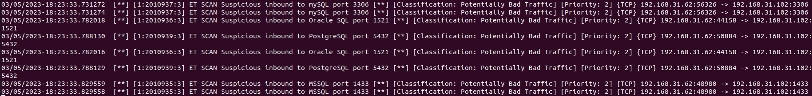
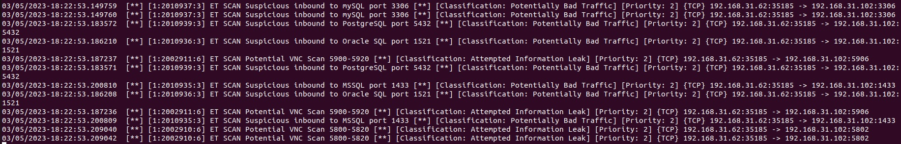
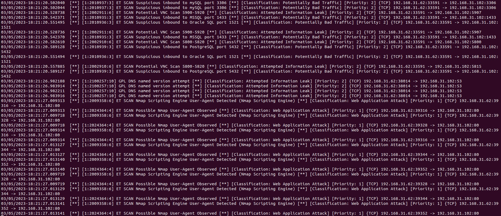
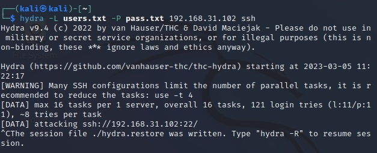
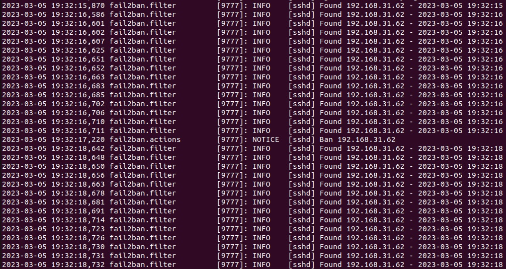
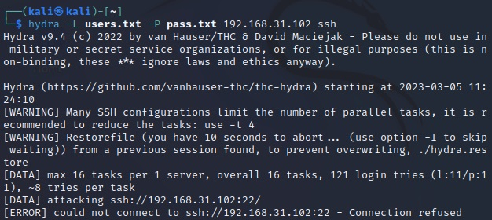

# Домашнее задание к занятию 13.3. «Защита сети» - Балдин Алексей

------

### Подготовка к выполнению заданий

1. Подготовка защищаемой системы:

- установите **Suricata**,
- установите **Fail2Ban**.

2. Подготовка системы злоумышленника: установите **nmap** и **thc-hydra** либо скачайте и установите **Kali linux**.

Обе системы должны находится в одной подсети.

------

### Задание 1

Проведите разведку системы и определите, какие сетевые службы запущены на защищаемой системе:

**sudo nmap -sA < ip-адрес >**

**sudo nmap -sT < ip-адрес >**

**sudo nmap -sS < ip-адрес >**

**sudo nmap -sV < ip-адрес >**

По желанию можете поэкспериментировать с опциями: https://nmap.org/man/ru/man-briefoptions.html.

*В качестве ответа пришлите события, которые попали в логи Suricata и Fail2Ban, прокомментируйте результат.*

### Решенеие:

*По результатам проведенных тестов, можно сделать вывод, что **Suricata** отследил работу **Nmap** в моменты следующих типов сканирования: -sT, -sS, -sV. При этом он предоставляет информацию о том, с какого IP-адреса/порта осуществляется атака, какой сервис подвергается атаке (соответственно, подсвечивает доверженные атаке IP/Port). В то же время при сканировании -sS **Suricata** никак не среагировал. Скриншоты вывода логов **Suricata** прилагаю:*

1) -sT - сканирование

2) -sS - сканирование

3) -sV - сканирование

------

### Задание 2

Проведите атаку на подбор пароля для службы SSH:

**hydra -L users.txt -P pass.txt < ip-адрес > ssh**

1. Настройка **hydra**: 
 
 - создайте два файла: **users.txt** и **pass.txt**;
 - в каждой строчке первого файла должны быть имена пользователей, второго — пароли. В нашем случае это могут быть случайные строки, но ради эксперимента можете добавить имя и пароль существующего пользователя.

Дополнительная информация по **hydra**: https://kali.tools/?p=1847.

2. Включение защиты SSH для Fail2Ban:

-  открыть файл /etc/fail2ban/jail.conf,
-  найти секцию **ssh**,
-  установить **enabled**  в **true**.

Дополнительная информация по **Fail2Ban**:https://putty.org.ru/articles/fail2ban-ssh.html.

*В качестве ответа пришлите события, которые попали в логи Suricata и Fail2Ban, прокомментируйте результат.*

### Решение:

*Прилагаю скриншоты по проведенному тесту (сразу прошу прощения за рассинхрон во времени - не углядел):*

*1. Запускаю подбор в первый раз на **Kali**:*

*2. **Fail2ban** отрабатывает атаку (банит "злоумышленника" 192.168.31.62):*

*3. Последующие атаки с **Kali** безуспешны:*

